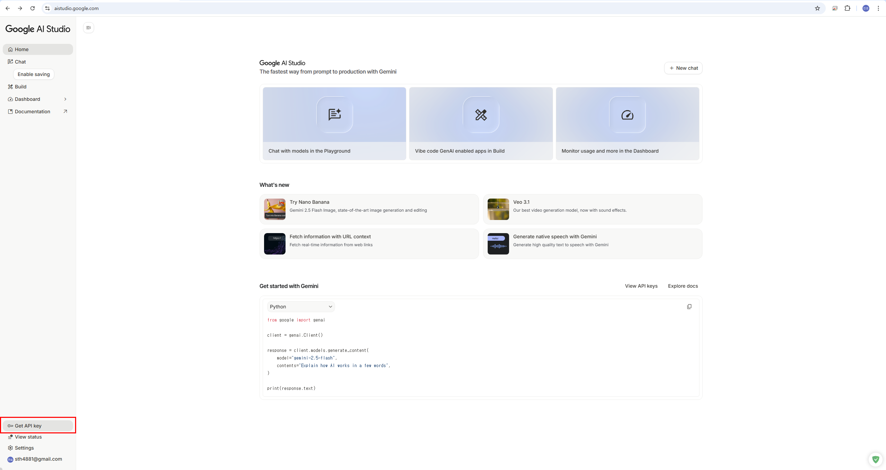
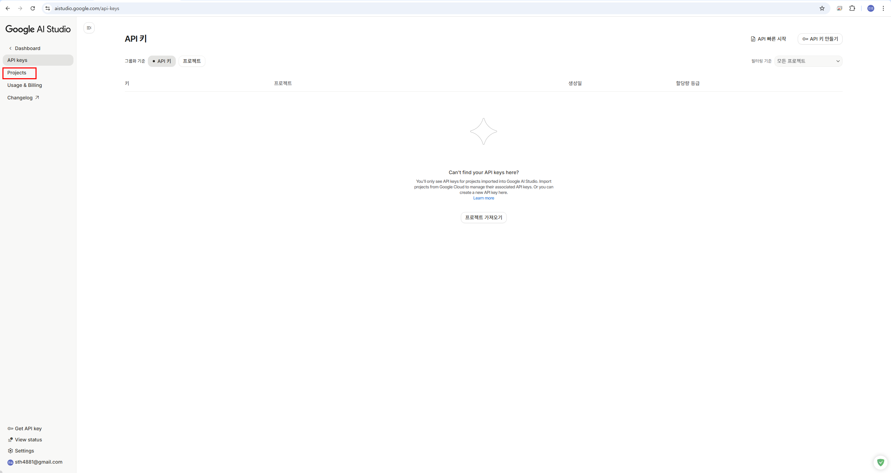
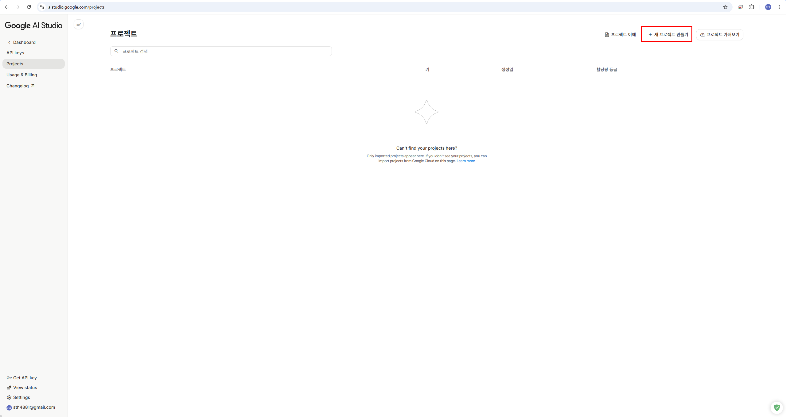
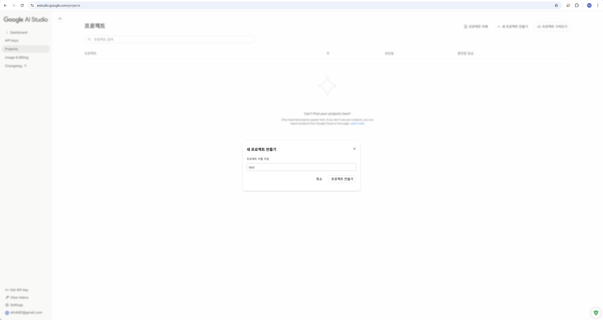
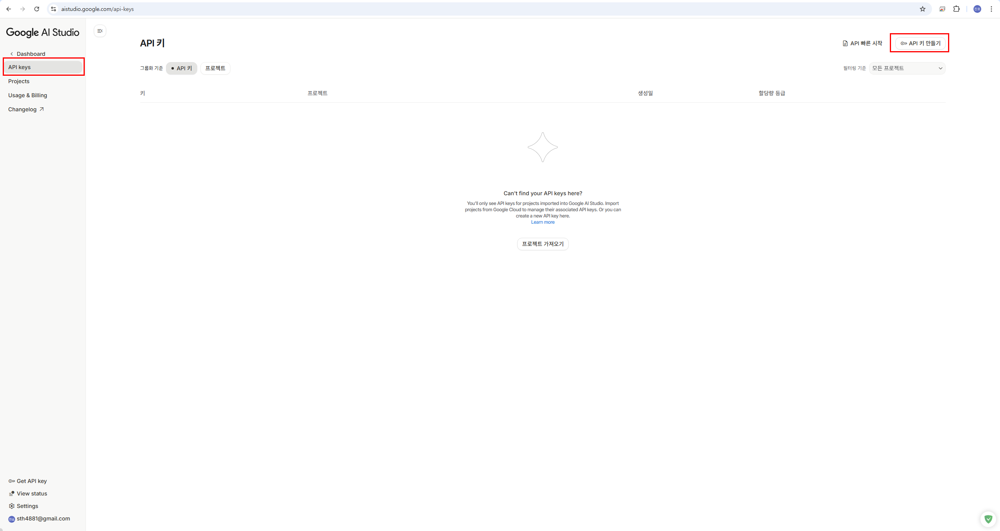
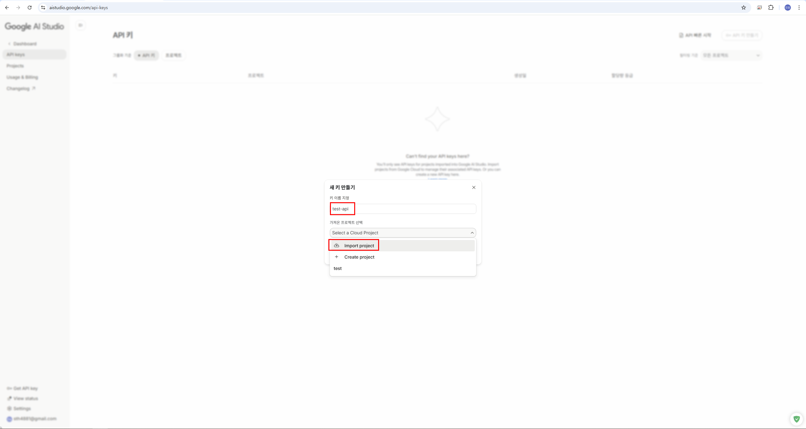
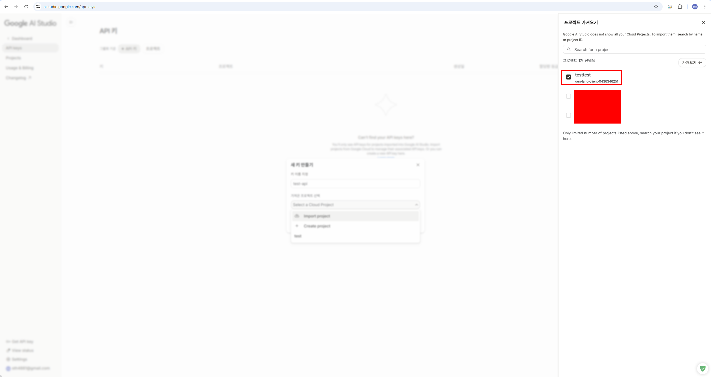
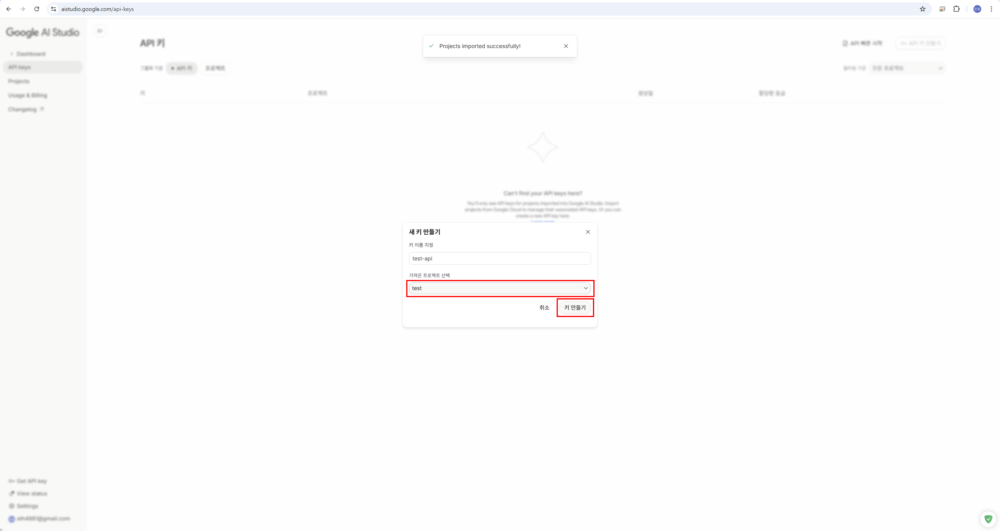
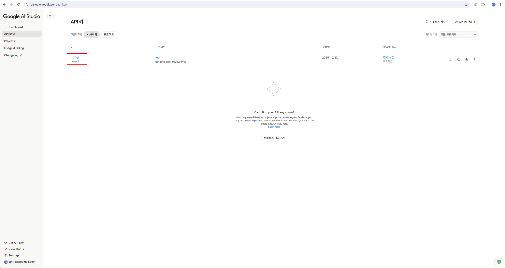
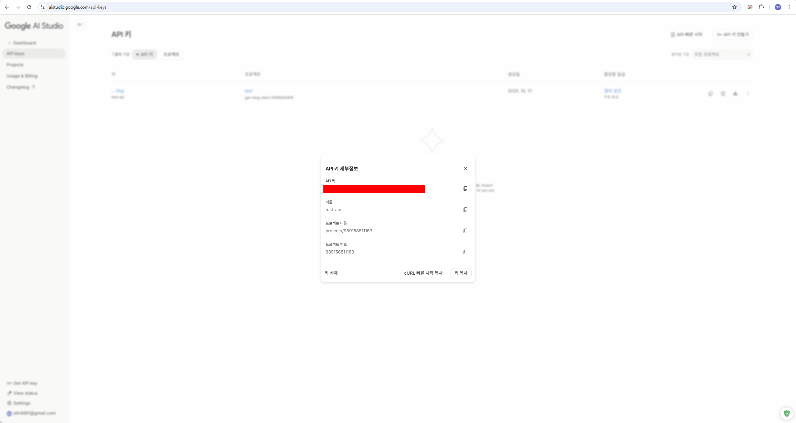

# VibeCraft

**VibeCraft**는 사용자 정의 주제를 기반으로 데이터 인과관계 분석 및 시각화 웹 페이지를 자동 생성하는 파이프라인입니다. **Claude**, **OpenAI GPT**, **Gemini**와 같은 대규모 언어 모델(LLM)을 **MCP (Model Context Protocol)** 생태계와 통합하여 주제 선택부터 웹 페이지 코드 생성까지 전체 워크플로우를 간소화합니다.

---

## 🚀 Overview

이 프로젝트는 데이터 인과관계 분석을 위한 자동화된 워크플로우로 구성됩니다:

1. **주제 정의 (Topic Definition)**
   - 사용자 프롬프트를 받아 AI 모델(Claude/GPT/Gemini)을 사용하여 분석 주제를 생성하고 정형화합니다.
   - 주제는 MCP 도구를 통해 다운스트림 모듈로 전달됩니다.

2. **데이터 수집 또는 업로드 (Data Collection/Upload)**
   - 사용자가 데이터를 제공하면 CSV 또는 SQLite 형식으로 저장됩니다.
   - 데이터가 업로드되지 않은 경우, 시스템이 자동으로 웹에서 주제 관련 데이터를 검색하고 스크래핑하여 로컬에 저장합니다.

3. **데이터 전처리 및 인과관계 분석 (Data Processing & Causal Analysis)**
   - 수집된 데이터를 자동으로 전처리합니다 (컬럼 정제, 영문 변환 등).
   - RAG(Retrieval-Augmented Generation)를 활용하여 학술 논문 기반의 인과관계 분석을 수행합니다.
   - 데이터 간의 상관관계, 인과관계, 영향도 등을 분석합니다.

4. **시각화 타입 선택 및 코드 생성 (Visualization & Code Generation)**
   - 분석 결과를 기반으로 최적의 시각화 타입을 자동으로 결정합니다.
   - 시각화, 레이아웃 구조 및 UI 컴포넌트를 포함한 완전한 웹 페이지를 생성합니다.

5. **자동 배포 (Auto Deployment - WIP)**
   - 생성된 웹 페이지를 `deploy_client`를 사용하여 **Vercel** 플랫폼에 자동 배포합니다.
   - 배포가 완료되면 사용자는 게시된 웹 페이지에 액세스할 수 있는 URL을 받습니다.

---

## 🧰 MCP & Environment Setup

이 프로젝트는 [Model Context Protocol (MCP)](https://modelcontextprotocol.io/introduction)을 기반으로 구축되었으며, 구조화된 프로토콜을 통해 클라이언트와 도구 간의 모듈식 통신을 가능하게 합니다.

### 🔌 MCP Components

- **MCP Server**: 특정 기능(예: 파일 I/O, HTTP 호출, 데이터베이스 작업)을 도구를 통해 제공합니다.
- **MCP Client**: MCP 서버와 상호 작용하여 요청을 보내고 구조화된 응답을 받습니다.

### 🛠 Environment Setup

#### 1. 저장소 클론
```bash
git clone https://github.com/vibecraft25/vibecraft-backend.git
cd vibecraft-backend
```

#### 2. [`uv`](https://github.com/astral-sh/uv) 설치 (Python 프로젝트 매니저)
```bash
# Windows
powershell -c "irm https://astral.sh/uv/install.ps1 | iex"
# MacOS/Linux
curl -LsSf https://astral.sh/uv/install.sh | sh
```

#### 3. 가상 환경 생성 및 활성화
```bash
uv venv --python=python3.12

# Windows
.venv\Scripts\activate
# MacOS/Linux
source .venv/bin/activate

uv init
```

#### 4. 의존성 설치
```bash
# pyproject.toml과 uv.lock을 기반으로 모든 의존성 자동 설치
uv sync
```
**설치되는 주요 패키지**:
- `langchain`, `langchain-anthropic`, `langchain-google-genai` - AI 모델 통합
- `mcp[cli]` - Model Context Protocol 클라이언트
- `chromadb`, `sentence-transformers` - RAG 벡터 데이터베이스
- `pandas`, `numpy` - 데이터 처리
- `fastapi`, `pydantic` - API 및 데이터 검증

#### 5. Node.js 확인 (MCP 서버용)
```bash
# Download and install Node.js from the official website:
# 👉 https://nodejs.org
npm -v
npm install -g @google/gemini-cli
npm install -g vibecraft-agent
```

#### 6. 프로젝트 설정 구성
필요시 `config-development.yml`을 환경에 맞게 수정하세요.
```text
```yaml
version:
  server: "1.0.0"

base_url: "http://127.0.0.1:8080"
host: "127.0.0.1"
port: 8080

resource:
  data: "[YOUR_PATH]/vibecraft-backend/storage"
  mcp: "[YOUR_PATH]/vibecraft-backend/mcp_agent/servers"

path:
  chat: "./chat-data"            # 채팅 기록
  file: "./data-store"           # 처리된 파일
  chroma: "./chroma-db"          # RAG 벡터 데이터베이스

log:
  path: "./vibecraft-app-python-log"
```

**중요 설정 사항:**
- `resource.data`: 사용자가 업로드한 파일 및 분석 결과가 저장되는 경로
- `resource.mcp`: MCP 서버 설정 파일들이 위치한 경로
- `path.chat`: 대화 기록이 저장되는 디렉토리
- `path.file`: 업로드된 파일 및 처리된 데이터가 저장되는 디렉토리
- `path.chroma`: ChromaDB 벡터 데이터베이스용 디렉토리 (RAG 엔진에서 사용)
- 모든 상대 경로는 프로젝트 루트에서 해석됩니다

#### 7 . 환경 변수 설정
**⚠️ .env 파일을 공유하거나 커밋하지 마세요. 민감한 자격 증명이 포함되어 있습니다. ⚠️**
```bash
# .env.example을 복사
# Windows
copy .env.example .env
# MacOS/Linux
cp .env.example .env
```
생성된 `.env` 파일을 열어 실제 API 키를 입력하세요:
```bash
# .env
OPENAI_API_KEY=your_openai_api_key_here
ANTHROPIC_API_KEY=your_anthropic_api_key_here
GEMINI_API_KEY=your_gemini_api_key_here
GOOGLE_API_KEY=your_google_api_key_here
```

### 🔑 GEMINI API KEY 발급 방법

#### 1.Google AI Studio(https://aistudio.google.com) 접속 후 Get API key 클릭


#### 2. Projects 들어가서 '새 프로젝트 만들기' - 입력한 이름으로 프로젝트 생성
 |  | 
-----------------|------------------|----------------|

#### 3. API keys 들어가서 'API 키 만들기' - 키 이름 지정 - 가져올 프로젝트 선택 (Import project)
 |  |  |
-----------------|------------------|------------------|

#### 4. 프로젝트 선택 후 '키 만들기' 결과로 API 키 생성 완료
 |  | 
-----------------|------------------|------------------|

---

## 🧠 Engine Architecture

각 엔진은 `BaseEngine`을 통해 공통 인터페이스를 구현합니다:

- `ClaudeEngine` – Anthropic Claude 사용 - [claude-3-5-sonnet-20241022]
- `OpenAIEngine` – OpenAI GPT 사용 - [gpt-4.1]
- `GeminiEngine` – Google Gemini 사용 - [gemini-2.5-flash]

각 엔진은 다음을 지원합니다:
- 다중 턴 대화
- MCP를 통한 동적 도구 호출
- 텍스트 및 함수 응답 처리
- RAG 기반 학술 논문 검색 및 분석

---

## 🔧 RAG Engine Setup

**VibeCraft는 학술 논문 기반의 인과관계 분석을 위해 RAG(Retrieval-Augmented Generation) 엔진을 사용합니다.**

### RAG 엔진 초기화 방법

1. **학술 논문 준비**
   - PDF, TXT, Markdown 등의 형식으로 된 학술 논문을 준비합니다.
   - `./storage/documents` 디렉토리에 논문 파일들을 저장합니다.

2. **RAG 엔진 초기화 코드** (`services/data_processing/rag_engine.py` 참조)

```python
from services.data_processing.rag_engine import RAGEngine
from config import settings

# RAG 엔진 초기화
rag_engine = RAGEngine(
    collection_name="documents",      # ChromaDB 컬렉션 이름
    chunk_size=800,                   # 문서 청크 크기
    chunk_overlap=100,                # 청크 간 겹침
    persist_directory=settings.chroma_path  # 벡터 DB 저장 경로
)

# 디렉토리의 모든 문서 인덱싱
result = rag_engine.add_documents_from_directory(
    f"{settings.data_path}/documents"
)
print(f"Indexed: {result['success']} files")

# 단일 문서 추가
rag_engine.add_document("path/to/your/paper.pdf")

# 검색 테스트
search_results = rag_engine.search(
    "causal inference methodology",
    k=5  # 상위 5개 결과 반환
)
```

3. **RAG 엔진 주요 기능**
   - `add_document(file_path)`: 단일 문서 인덱싱
   - `add_documents_from_directory(directory_path)`: 디렉토리 전체 인덱싱
   - `search(query, k)`: 유사도 기반 문서 검색
   - `delete_document(file_path)`: 문서 삭제
   - `reset()`: 모든 인덱스 초기화
   - `as_retriever()`: LangChain retriever로 변환

4. **지원되는 파일 형식**
   - PDF (.pdf)
   - Text (.txt)
   - Markdown (.md)

---

## 📡 API Endpoints

### 🗨️ Chat API (`/chat`)

#### 1. 새 채팅 시작
```http
GET /chat/new-chat?query={prompt}&use_langchain=true&system={custom_system_prompt}
```
**Parameters:**
- `query` (required): 사용자 질문
- `use_langchain` (optional, default: true): LangChain 사용 여부
- `system` (optional): 커스텀 시스템 프롬프트

**Response:**
```json
{
  "thread_id": "f09d8c6e-fcb5-4275-bf3d-90a87ede2cb8",
  "response": "AI 응답 내용"
}
```

#### 2. 기존 채팅 로드
```http
GET /chat/load-chat?query={prompt}&thread_id={thread_id}&use_langchain=true&system={custom_system_prompt}
```

#### 3. 새 채팅 스트리밍
```http
GET /chat/stream/new-chat?query={prompt}&use_langchain=true&system={custom_system_prompt}
```
**SSE Events:**
- `ai`: AI 응답 내용
- `tool`: MCP 서버 도구 사용 결과
- `complete`: 작업 완료 (thread_id 반환)
- `error`: 에러 발생

#### 4. 기존 채팅 스트리밍 로드
```http
GET /chat/stream/load-chat?query={prompt}&thread_id={thread_id}&use_langchain=true&system={custom_system_prompt}
```

#### 5. 전체 파이프라인 실행 (자동화)
```http
GET /chat/stream/pipeline?topic_prompt={topic}&file_path={file_path}
```
**Parameters:**
- `topic_prompt` (required): 분석 주제
- `file_path` (optional): 데이터 파일 경로

**자동 실행 단계:**
1. 주제 선택
2. 데이터 업로드/설정
3. 데이터 자동 전처리
4. 인과관계 분석 (RAG)
5. 시각화 타입 자동 선택
6. 코드 자동 생성

#### 6. 채팅 기록 조회
```http
GET /chat/history?thread_id={thread_id}
```

#### 7. 채팅 요약 조회
```http
GET /chat/summary?thread_id={thread_id}
```

---

### 📊 Workflow API (`/workflow`)

#### 1. 주제 설정
```http
GET /workflow/stream/topic?query={prompt}
```
**SSE Events:**
- `ai`: AI가 주제를 분석하고 설정하는 과정
- `tool`: MCP 서버 도구 사용
- `menu`: 다음 단계 선택 메뉴
- `complete`: 주제 설정 완료 (thread_id 반환)
- `error`: 에러 발생

#### 2. 데이터 분석 및 코드 생성 실행
```http
GET /workflow/stream/run?thread_id={thread_id}&code={file_code}
```
**Parameters:**
- `thread_id` (required): 주제 설정 결과로 응답받은 thread_id
- `code` (required): 파일 업로드 결과로 응답받은 code

---

### 📁 Content API (`/contents`)

#### 1. 파일 업로드
```http
POST /contents/upload?thread_id={thread_id}
Content-Type: multipart/form-data

file: [CSV/Excel/SQLite 파일]
```
**Response:**
```json
{
  "code": "f09d8c6e.csv"  // '2. 데이터 분석 및 코드 생성 실행'에 붙여넣을 때 반드시 확장자를 제거하고 복사
}
```

#### 2. 메타데이터 조회
```http
GET /contents/meta?thread_id={thread_id}
```
**Response:**
```json
{
  "created_at": "2025-01-15T10:30:00",
  "column_mapping": {
    "원본컬럼1": "english_column_1",
    "원본컬럼2": "english_column_2"
  }
}
```

---

## 🧪 API 테스트 예제

### cURL 예제

#### 1. 새 채팅 시작
```bash
curl -X GET "http://127.0.0.1:8080/chat/new-chat?query=판매량과%20마케팅%20예산의%20인과관계를%20분석해주세요&use_langchain=true"
```

#### 2. 파일 업로드
```bash
curl -X POST "http://127.0.0.1:8080/contents/upload?thread_id=f09d8c6e-fcb5-4275-bf3d-90a87ede2cb8" \
  -F "file=@data.csv"
```

#### 3. 전체 파이프라인 실행 (SSE)
```bash
curl -N "http://127.0.0.1:8080/chat/stream/pipeline?topic_prompt=기온과%20에너지%20소비량%20관계%20분석&file_path=./data.csv"
```

### Python 예제

```python
import requests
import json

# 1. 새 채팅 시작
response = requests.get(
    "http://127.0.0.1:8080/chat/new-chat",
    params={
        "query": "서울시를 기준으로 음식 분류별 맛집 리스트를 시각화하는 페이지를 만들어줘",
        "use_langchain": True
    }
)
result = response.json()
thread_id = result["thread_id"]
print(f"Thread ID: {thread_id}")

# 2. 파일 업로드
with open("data.csv", "rb") as f:
    files = {"file": f}
    upload_response = requests.post(
        f"http://127.0.0.1:8080/contents/upload?thread_id={thread_id}",
        files=files
    )
    file_code = upload_response.json()["code"]
    print(f"File Code: {file_code}")

# 3. 워크플로우 실행 (SSE 스트림)
import sseclient

response = requests.get(
    f"http://127.0.0.1:8080/workflow/stream/run?thread_id={thread_id}&code={file_code}",
    stream=True
)

client = sseclient.SSEClient(response)
for event in client.events():
    data = json.loads(event.data)
    print(f"Event: {data['type']}, Content: {data.get('content', '')}")
```

### JavaScript (Fetch API) 예제

```javascript
// SSE 스트림 수신
const eventSource = new EventSource(
  'http://127.0.0.1:8080/chat/stream/new-chat?query=데이터%20분석%20요청&use_langchain=true'
);

eventSource.addEventListener('ai', (event) => {
  const data = JSON.parse(event.data);
  console.log('AI Response:', data.content);
});

eventSource.addEventListener('complete', (event) => {
  const data = JSON.parse(event.data);
  console.log('Thread ID:', data.thread_id);
  eventSource.close();
});

eventSource.addEventListener('error', (event) => {
  console.error('Error:', event);
  eventSource.close();
});
```

---

## 🚀 서버 실행

```bash
# 개발 모드로 서버 실행
uvicorn main:app --reload --host 127.0.0.1 --port 8080

# 또는
python main.py
```

서버가 시작되면 다음 주소에서 API 문서를 확인할 수 있습니다:
- Swagger UI: http://127.0.0.1:8080/docs
- ReDoc: http://127.0.0.1:8080/redoc

---

## 📁 프로젝트 구조

```plaintext
.
├── core/
│   ├── cors.py                 # CORS error handler
│   ├── exception_handler.py    # Exception handler
│   └── logger.py               # logger
│
├── exceptions/
│   ├── base_custom_exception.py
│   ├── not_found.py
│   └── unauthorized.py
│
├── mcp_agent/
│   ├── client/
│   │   ├── vibe_craft_agent_runner.py    # agent runner
│   │   └── vibe_craft_client.py          # Main pipeline client using MCP stdio
│   │
│   ├── engine/
│   │   ├── base.py               # Abstract base engine (RAG, LangGraph)
│   │   ├── claude_engine.py      # Claude model integration
│   │   ├── openai_engine.py      # OpenAI GPT integration
│   │   └── gemini_engine.py      # Gemini model integration
│   │
│   ├── schemas/
│   │   ├── chat_history_schemas.py     # LLM chat history schemas
│   │   └── server_schemas.py           # Server config schemas
│   │
│   └── servers/
│       └── config.json           # MCP servers configuration
│
├── routers/
│   ├── chat.py         # chat api (new-chat, load-chat, stream, pipeline)
│   ├── content.py      # file upload api
│   └── workflow.py     # workflow api (topic, run)
│
├── schemas/
│   ├── chat_history_schemas.py   # Chat history schemas
│   ├── data_schemas.py           # Data schemas
│   └── sse_response_schemas.py   # SSE response schemas
│
├── services/
│   ├── business/
│   │   ├── chat_service.py       # chat service logic
│   │   └── workflow_service.py   # workflow service logic
│   │
│   └── data_processing/
│       ├── rag/
│       │   ├── chroma_db.py               # ChromaDB wrapper
│       │   └── document_processor.py      # 문서 인덱싱
│       │
│       └── rag_engine.py       # RAG engine (학술 논문 검색)
│
├── utils/
│   ├── code_generator.py     # File code generator
│   ├── file_utils.py         # Data load and File utils for Agent
│   ├── content_utils.py      # Content utils
│   ├── menus.py              # User menu options
│   ├── path_utils.py         # File save path generator
│   └── prompts.py            # LLM prompts (인과관계 분석 전문)
│
├── config-development.yml    # Development configuration
├── config-staging.yml        # Staging configuration
├── config.py                 # Config loader
├── main.py                   # FastAPI entry point
├── vibecraft-code.py         # VibeCraft CLI workflow
├── .env                      # Environment variables (create this)
└── README.md
```

---

## ✅ 주요 기능

- 🔧 플러그형 모델 엔진 (Claude, GPT, Gemini)
- 🧠 지능형 프롬프트-주제 생성
- 📊 자동 데이터 전처리 및 인과관계 분석
- 🔬 RAG 기반 학술 논문 검색 및 검증
- 📈 자동 시각화 타입 선택 및 추천
- 💻 차트 및 시각화를 포함한 코드 생성
- 🌐 웹 스크래핑을 통한 데이터 수집 (백업)
- 🔁 단계별 탐색 및 재실행 지원
- 🚀 SSE 스트리밍을 통한 실시간 응답

---

## 🔬 인과관계 분석 특화 기능

VibeCraft는 데이터 인과관계 분석에 특화된 다음 기능을 제공합니다:

1. **자동 변수 관계 분석**
   - 상관관계(Correlation) vs 인과관계(Causation) 구분
   - 변수 간 영향도(Impact) 분석
   - 추세(Trend) 및 패턴(Pattern) 감지

2. **RAG 기반 학술 검증**
   - 인과추론 방법론 관련 학술 논문 검색
   - 통계적 검증 방법 제안
   - 데이터 기반 인과 메커니즘 발견

3. **시각화 자동 추천**
   - 산점도(Scatter Plot): 상관관계 분석
   - 시계열(Time Series): 추세 분석
   - 박스플롯(Box Plot): 그룹 간 비교
   - 히트맵(Heatmap): 다변량 상관관계

---

## 📚 References

- https://python.langchain.com/docs/introduction/
- https://python.langchain.com/docs/versions/migrating_memory/conversation_buffer_memory/
- https://langchain-ai.github.io/langgraph/how-tos/memory/add-memory/
- https://modelcontextprotocol.io/introduction
- https://digitalbourgeois.tistory.com/1017
- https://rudaks.tistory.com/entry/langgraph-대화-이력을-요약하는-방법

---

## 📝 License

이 프로젝트는 Apache License 2.0 하에 배포됩니다. 자세한 내용은 [LICENSE](./LICENSE) 파일을 참고하세요.

---

## 👥 Contributors

- Se Hoon Kim (sehoon787@korea.ac.kr)
